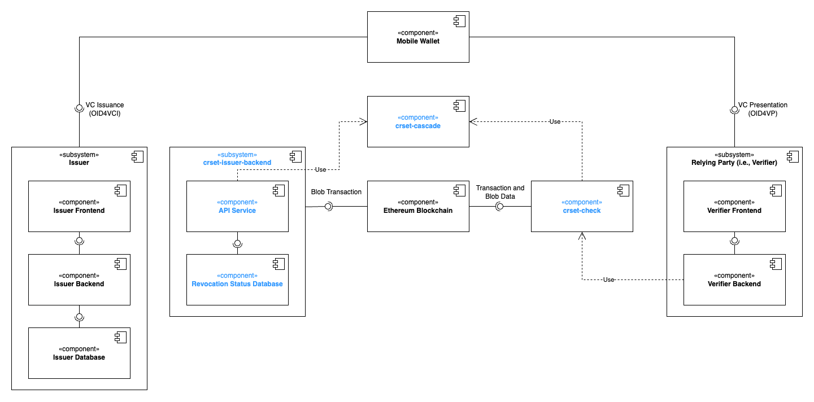

# CRSet Demonstrator

This project is a showcase of CRSet, the novel revocation mechanism for _W3C Verifiable Credential_ with **cascading padded Bloom filters**, as proposed in the paper **[CRSet: Non-Interactive Verifiable Credential Revocation with Metadata Privacy for Issuers and Everyone Else](https://arxiv.org/abs/2501.17089)**.

## Demo Content

The demo consists of two parts: the _issuer demo_ and the _verifier demo_, which have to be started separeately. To experience the demo, a smartphone with an SSI wallet app is needed. Any wallet app with OID4VC support should work. The Altme app worked well in testing.

### Issuing an Employee ID VC with CRSet Support

The _issuer demo_ resembles a simple HR tool that allows a company to issue employee IDs as VCs for employees:

1. Click on "Start Issuing"
2. Enter arbitrary employee info and click "Generate Verifiable Credential"
3. Scan the QR code with the smartphone and follow the directions to obtain the newly issued epmloyee ID VC

The tool also gives an overview over issued VCs and allows revocation:

1. Navigate to the "Employee List" tab
2. Select any number of VCs to revoke and press the button labeled "Revoke"

To make the revocations public, a manually triggered rebuild and publishing of the CRSet is required:

1. On the "Employee List" tab, click on "Publish CRSet"
2. On the next page, click "Confirm Publication" to trigger the process
3. Watch the updates in real time as the system builds the Bloom filter cascade and sends the blob-carrying transaction

The _issuer demo_ also offers a dashboard showing the past publications and associated data, such as cost, time, and data size. It also includes direct links to block and blob explorers to dive in further.


### Verifying Employment Status To Take Out a Loan

The _verifier demo_ is a mock up of a banking site allowing loan applicants to proove their employment status with their employment ID VC:

1. Click "Apply for a loan now!"
2. Enter arbitrary data for personal data and click next
3. Enter arbitrary loan data and click next
4. Scan the QR code with the smartphone and follow directions to present the employmee ID VC
5. Observe how the website updating the verification progress with emphasis on the revocation check in real time


## Technical Overview

> [!NOTE]
> This demo was built first and foremost to be easy to set up and run. Security-critical aspects like session-management have been excluded since they are not core to showing the CRSet mechanism itself.

### Components



### Folder Structure

The project is structured as follows (only the most relevant files and folders are shown):

```bash
|-- crset-demo/
    |-- issuer-demo/
    |   |-- Dockerfile
    |   |-- package.json
    |   |-- database/
    |   |-- src/
    |-- verifier-demo/
    |   |-- client/
    |   |   |-- Dockerfile
    |   |   |-- package.json
    |   |   |-- src/
    |   |-- server/
    |   |   |-- Dockerfile
    |   |   |-- package.json
    |   |   |-- src/
    |-- .env.example
    |-- compose.yaml
```

## Prerequisites

Several prerequisites are required in order to run the demo. These are outlined below.

### SSI Wallet

This demo requires an SSI Wallet supporting OID4VC protocols, like Altme Wallet. To install Altme, follow the instructions on the [Altme Wallet website](https://altme.io/). Once installed, create a new wallet and save the private key.

### CRSet Issuer Backend

As mentioned earlier, this demo requires the **[crset-issuer-backend](https://github.com/jfelixh/crset-issuer-backend)** to be running in order to manage credentials. To start it, follow the instructions in the [README](https://github.com/jfelixh/crset-issuer-backend/blob/main/README.md) of that repository. The docker compose setup of this demo expects the _crset-issuer-backend_ to be available at the default `localhost:5050`.

### External URL

To make the demo pages publicly accessible (for the wallet app), a tool like [ngrok](https://ngrok.com) is required.
The _issuer demo_ and _verifier demo_ are set up such that both their backends run on port 3000.

Using ngrok, an external URL can be set up with:

```sh
ngrok http 3000
```

The terminal process will keep running and show the external url, looking somethign like: `https://<random-string>.ngrok-free.app`.

### Environment Variables

This demo requires several environment variables. These are specified in the `.env` file. An examplefile `.env.example` with some explanations is provided to be copied. It can be found [here](./.env.example).

## Running the Demo

Once the prerequisites are met, the demo can be run. Since we assume only one external URL to be available (e.g., via ngrok), the issuer and verifier applications can be started separately. To start the services required for the demo, run one of the following commands:

```sh
docker compose --profile issuer up --build
```

or

```sh
docker compose --profile verifier up --build
```

This will start the respective demo.
The _issuer demo_ can be accessed at `http://localhost:3000` and the _verifier demo_ can be accessed at `http://localhost:3001`.

## Links and References

-  **[CRSet: Non-Interactive Verifiable Credential Revocation with Metadata Privacy for Issuers and Everyone Else](https://arxiv.org/abs/2501.17089)**  
  _Hoops et al., 2025._
-  **[crset-issuer-backend](https://github.com/jfelixh/crset-issuer-backend)**
-  **[crset-check](https://github.com/jfelixh/crset-check)**
- 
  **[crset-cascade](https://github.com/jfelixh/crset-cascade/)**

- **[EIP-4844: Shard Blob Transactions](https://eips.ethereum.org/EIPS/eip-4844)**
- **[W3C Verifiable Credentials Data Model 1.1](https://www.w3.org/TR/vc-data-model/)**

